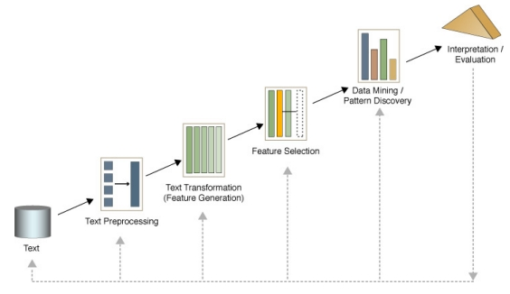
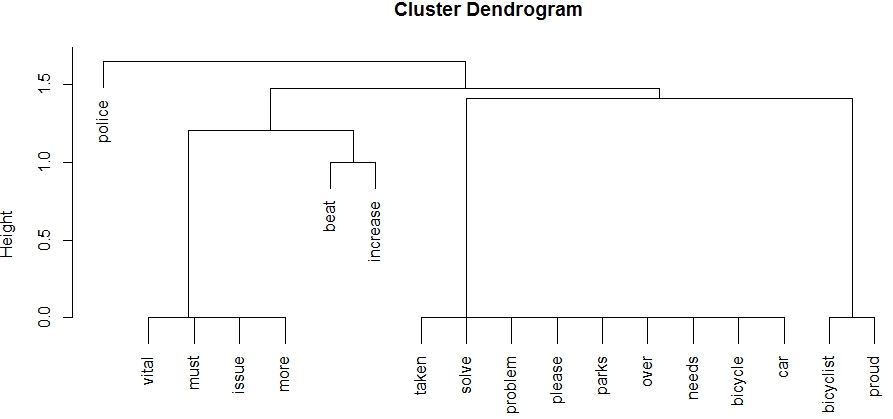
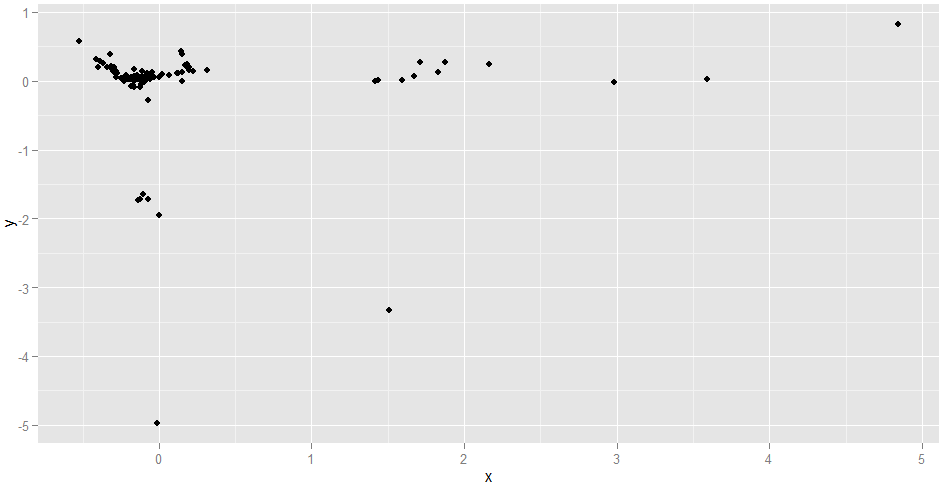
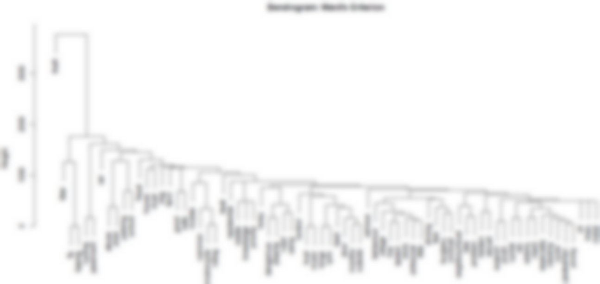
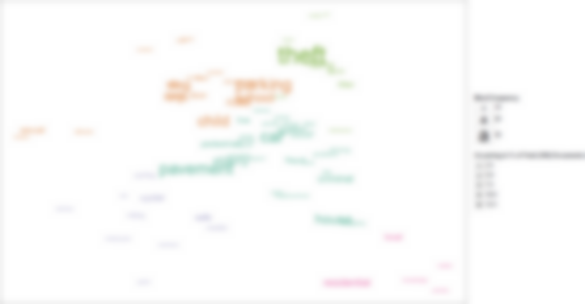
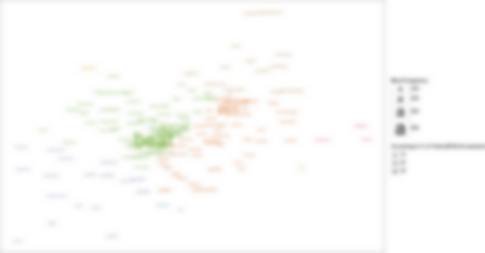
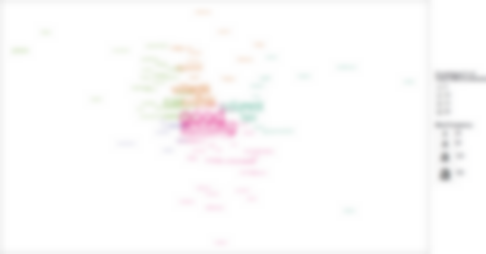
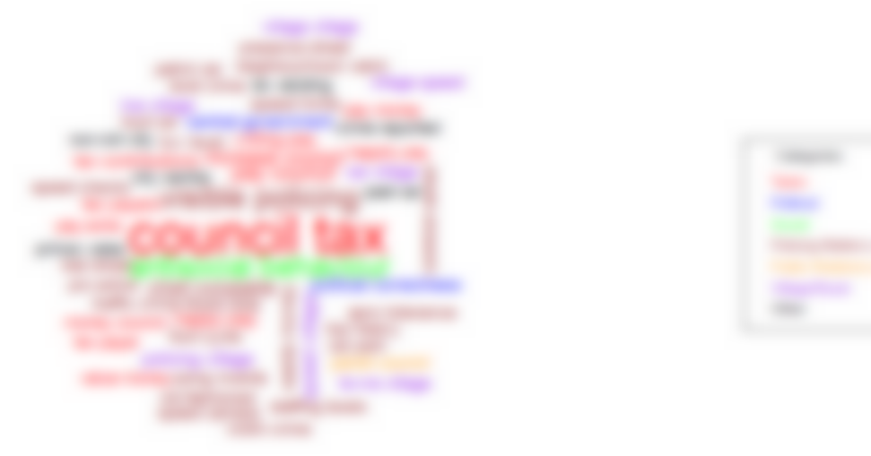

## Introduction

>- England and Wales Police & Crime Commissioner Elections, 2012 

>- Norfolk Policing Survey: "Making a Difference"
	- Quantitative & Qualitative questions
	- Crime, Anti-social behaviour, Customer Service, etc. 

>- Analysis of survey
	- To gain information on views of people at Norfolk
	- Information gained would assist in policy-making 

---

## Quantitative Data

### Research Questions

>- Is complaint, x, correlated with age, y? 
>- What's the difference between the means of various age groups of respondents? 
>- What is the frequency distribution of respondents from various districts? 
>- Is there a causal relationship between age, y, and the type of complaint submitted, x?
>- Cluster Analysis: can respondents be grouped based on variables such as x or y?
>- etc.

---

## Qualitative Data

### Research Questions

- Is x correlated with y? 
- What's the difference between the means of various age groups of respondents? 
- What is the frequency distribution of respondents from various districts? 
- Is there a causal relationship between age and the type of complaint submitted?
- Cluster Analysis: can respondents be grouped based on their characteristic variables?
- etc.

---

## Qualitative Data

### Research Questions

- <del> Is x correlated with y? </del>
- <del> What's the difference between the means of various age groups of respondents? </del>
- <del> What is the frequency distribution of respondents from various districts? </del>
- <del> Is there a causal relationship between age and the type of complaint submitted? </del>
- <del> Cluster Analysis: can respondents be grouped based on their characteristic variables? </del>
- <del> etc. </del>

---

## Qualitative Data

### Research Questions
	
>- Which are the most frequent/important words?
>- What are the contents of the responses?
>- Which responses are similar/dissimilar?
>- Which words are related/unrelated?
>- What sentiment is expressed in responses?
>- etc.

--- .segue .quote .dark

<q> Everyday language is a part of the human organism and is no less complicated than it.</q> 

[Ludwig Wittgenstein] (http://www.gutenberg.org/files/5740/5740-pdf.pdf)

---

## Qualitative Data

### Challenges

>- Natural Language
	
>- Synoynmy
	- Do 'theft' and 'burglary' have different meanings for our purposes?

>- Polysemy
	- 'Patrol' as noun and verb

>- Domain specific words
	- 'Beat' in the police terminology

>- Words influenced by History/Culture

--- .segue .dark

## Qualitative Data is different...

--- .segue .dark

## Text Mining!

--- .segue .dark

## But: How?

--- &vcenter

## Text Mining Framework ##

Obtained from Dr. Beatriz's lecture on Text Mining

--- .segue .dark

## Phase 1: Text Preprocessing

---

## Phase 1: Text Preprocessing

<b>Objective:</b> Apply operations to 'reshape' data into a format suitable for Text Mining. 

>- Standardisation
	- To give a unified format to all data

>- Stopwords Removal
	- "That", "this", "mine", "should" are not informative
	- Domain-specific stopwords

>- Thesaurus
	- 'Bobby' and 'Police'
	- 'Car parks' and 'Parking'.
	- 'Crime' and 'Offence'

---

## Phase 1: Stopwords & Thesaurus

### Example

- <b>Document 1:</b>

 This is a vital issue and more bobbies must be on the beat. Increase the beat.

- <b>Document 2:</b>

 Police needs to solve the problem. Car parks have been taken over by bicycles! Please increase Police beat too! 

- <b>Document 3:</b>

 I am a cyclist and I am proud of it! 

---

## Phase 1: Stopwords & Thesaurus

### Example

- <b>Document 1:</b>

 This is a vital issue and  more bobbies  must be on the  beat. Increase the  beat. 

- <b>Document 2:</b>

 Police needs to solve the problem. Car parks have been  taken over by bicycles! Please increase Police beat too!  

- <b>Document 3:</b>

 I am a cyclist and I am proud of it! 

---

## Phase 1: Stopwords & Thesaurus

### Example

- <b>Document 1:</b>

 vital issue more police must be on beat increase beat 

- <b>Document 2:</b>

 police needs solve problem car parks taken over by bicycle please increase police beat 

- <b>Document 3:</b>

 bicyclist proud 

---

## Section Summary

>- <b>Text Preprocessing objectives: </b>
	- To standardise textual data found in different formats
	- To remove irrelevant/less informative words
	- To replace synonymous words with a single word expressing the same meaning

>- <b>Text Preprocessing Techniques:</b>
	- Standardisation of documents
	- Stopwords' removal
	- Thesaurus

--- .segue .dark

## Phase 2: Feature Generation

---

## Phase 2: Feature Generation

<b>Objective:</b> Apply operations to generate representations of Textual data.

>- Basic unit of representation
	- Terms (single words, word pairs, phrases)
	- Documents/responses
>- Choose a matrix format to generate from representation units
	- Term-Document Matrix [(Salton et al., 1975)](http://citeseerx.ist.psu.edu/viewdoc/download?doi=10.1.1.107.7453&rep=rep1&type=pdf)
	- Term-Affiliations Matrix
>- Choose settings for matrix
	- Binary Frequency
	- Term Frequency
	- Term Frequency X Inverse Document Frequency

---

## Phase 2: Term-Document Matrix (Binary)

>- <b> Term-Document Matrix </b>
	- A representation of textual data in which Terms are represented as rows, and documents(responses) as columns.
	- Easily produced automatically.
	- Word sequences not accounted for.
	- [Statistical Semantics Hypothesis](http://en.wikipedia.org/wiki/Statistical_semantics) [(Weaver, 1955] (http://www.mt-archive.info/Weaver-1949.pdf); [Furnal et al., 1983)](http://furnas.people.si.umich.edu/Papers/FurnasEtAl1983_BSTJ_p1753.pdf)
>- <b> Binary Frequency </b>
	- A representation that takes into account the presence/absence of Terms, by using 1s and 0s.

---

## Phase 2: Term-Document Matrix (Binary)

Words | Document 1 | Document 2| Document 3
------|------------|-----------|-----------
beat	 | 1		   | 1         | 0
bicycle| 0         | 1         | 0
bicyclist| 0       | 0         | 1
car	 | 0          | 1         | 0
increase| 1        | 1         | 0
issue  | 1         | 0         | 0
...    | ...       | ...       | ...

---

## Phase 2: Term-Document Matrix (Term Frequency)

>- <b> Term-Document Matrix </b>
	- A representation of textual data in which Terms are represented as rows, and documents as columns.
	- Easily produced automatically.
	- Word sequences not accounted for.
	- [Statistical Semantics Hypothesis](http://en.wikipedia.org/wiki/Statistical_semantics) [(Weaver, 1955] (http://www.mt-archive.info/Weaver-1949.pdf); [Furnal et al., 1983)](http://furnas.people.si.umich.edu/Papers/FurnasEtAl1983_BSTJ_p1753.pdf)
>- <b> Term Frequency </b>
	- A representation that takes into account the total number of times a Term occurs in a Document.
	- Term importance defined by its frequency
	- More frequent words attain greater importance

---

## Phase 2: Term-Document Matrix (Term Frequency)

Words | Document 1 | Document 2| Document 3
------|------------|-----------|-----------
beat  | 2          | 1         | 0
bicycle| 0         | 1         | 0
bicyclist| 0       | 0         | 1
car   | 0          | 1         | 0
increase| 1        | 1         | 0
issue | 1          | 0         | 0
...   | ...        | ...       | ...

---

## Phase 2: Term-Document Matrix (Tf-Idf)

>- <b> Term-Document Matrix </b>
	- A representation of textual data in which Terms are represented as rows, and documents as columns.
	- Easily produced automatically.
	- Word sequences not accounted for.
	- [Statistical Semantics Hypothesis](http://en.wikipedia.org/wiki/Statistical_semantics) [(Weaver, 1955] (http://www.mt-archive.info/Weaver-1949.pdf); [Furnal et al., 1983)](http://furnas.people.si.umich.edu/Papers/FurnasEtAl1983_BSTJ_p1753.pdf)
>- <b> Term Frequency X Inverse Doc. Frequency</b> 
	- A representation that takes into account the number of times a Term occurs in documents, as well as the total number of Documents in which it occurs.
	- Term importance defined by a high Term frequency **and** a low document frequency
	- Rare terms in the document collection that possibly <i>define</i> their documents attain greatest importance

---

## Phase 2: Term-Document Matrix (Tf-Idf)

Words | Document 1 | Document 2| Document 3
------|------------|-----------|-----------
beat  | 0.528      | 0.176     | 0
bicycle| 0         | 0.4771    | 0
bicyclist| 0       | 0         | 0.4771
car	| 0           | 0.4771    | 0
increase| 0.176    | 0.176     | 0
issue	| 0.4771      | 0         | 0
...	| ...         | ...       | ...

---

## Phase 2: Term-Affiliations Matrix

>- <b> Term-Affiliations Matrix </b>
	- Also known as Word co-occurrences matrix
>- <b> Term Frequency </b>

---

## Phase 2: Term-Affiliations Matrix

Words | beat | bicycle| bicyclist | car | increase | issue | ...
------|------|--------|-----------|-----|----------|-------|----
beat  | 5    | 1      | 0         | 0   | 3        | 2     | ...
bicycle| 1   | 1      | 0         | 1   | 1        | 0     | ...
bicyclist| 0 | 0      | 1         | 0   | 0        | 0     | ...
car   | 1    | 1      | 0         | 1   | 1        | 0	| ...
increase| 3  | 1      | 0         | 1   | 2        | 1     | ...
issue | 2     | 0     | 0         | 0   | 1        | 1     | ...
...   | ...  | ...    | ...       | ... | ...      |...    | ...

---

## Section Summary

>- <b>Feature Generation objectives: </b>
	- To generate a representation of terms (words, phrases, etc.) and responses/documents
>- <b>Representation can be of different types:	 </b>
	- Term-Document Matrix
	- Term-Affiliations Matrix
	- etc.
>- <b>To assign importance to terms as required for analysis: </b>
	- Binary
	- Term Frequency
	- Term Frequency - Inverse Document Frequency
	- etc.

--- .segue .dark

## Phase 3: Feature Selection

---

## Phase 3: Feature Selection

>- There may exist a large number of Terms in a Term Document Matrix (High-Dimensionality)

---

## Phase 3: Feature Selection

- There may exist a large number of Terms in a Term Document Matrix (High-Dimensionality)

Word # | Words   | Document 1 | Document 2| Document 3 | ...
-------|---------|------------|-----------|------------|-----
1      |beat     | 2          | 1         | 0          | ...
2      |bicycle  | 0          | 1         | 0          | ...
3      |bicyclist| 0          | 0         | 1          | ...
4      |car      | 0          | 1         | 0          | ...
5      |increase | 1          | 1         | 0          | ...
6      |issue    | 1          | 0         | 0          | ...
...    |...      | ...        | ...       | ...        | ...
4573   |zeal     | 1          | 0         | 0          | ...

>- Not all of the Terms will be useful
	- Many Terms only present in a few documents (known as Sparse Terms)
	- Unclear how these Terms are related to other, frequently occurring ones

---

## Phase 3: Feature Selection

- There may exist a large number of Terms in a Term Document Matrix (High-Dimensionality)

Word # | Words   | Document 1 | Document 2| Document 3 | ...
-------|---------|------------|-----------|------------|-----
1      |beat     | 2          | 1         | 0          | ...
2      |bicycle  | 0          | 1         | 0          | ...
3      |bicyclist| 0          | 0         | 1          | ...
4      |car      | 0          | 1         | 0          | ...
5      |increase | 1          | 1         | 0          | ...
6      |issue    | 1          | 0         | 0          | ...
...    |...      | ...        | ...       | ...        | ...
4573   |zeal     | 1          | 0         | 0          | ...

- A large number of Terms poses challenges to efficient computation
	- In addition to Text Mining operations

---

## Phase 3: Feature Selection

- There may exist a large number of Terms in a Term Document Matrix (High-Dimensionality)

Word # | Words   | Document 1 | Document 2| Document 3 | ...
-------|---------|------------|-----------|------------|-----
1      |beat     | 2          | 1         | 0          | ...
2      |bicycle  | 0          | 1         | 0          | ...
3      |bicyclist| 0          | 0         | 1          | ...
4      |car      | 0          | 1         | 0          | ...
5      |increase | 1          | 1         | 0          | ...
6      |issue    | 1          | 0         | 0          | ...
...    |...      | ...        | ...       | ...        | ...
4573   |zeal     | 1          | 0         | 0          | ...

- <b> Objective: Focus only on important Terms </b>

---

## Phase 3: Feature Selection

### How to measure Feature/Term Importance?

>- Depends on the Text Mining operation to be applied and type of data in Term-Document Matrix

>- Term Frequency lowerbounds
	- Discard all Terms with a value less than a pre-determined lowerbound

>- Term Frequency X Inverse Document Frequency lowerbounds
	- Discard all Terms with a value less than a pre-determined lowerbound

>- Preset Sparsity level for Terms

>- etc.

---

## Section Summary

>- Not all terms in a Term-Document Matrix will be important
>- <b>Feature Selection Objective:</b>
	- To distinguish important terms from unimportant terms
>- Choice of Feature Selection measure:
	- Depends on the task (Classification, Clustering) and type of data in Term-Document Matrix
	- Term Frequency lowerbounds
	- Sparsity level lowerbounds
	- etc.

--- .segue .dark

## Phase 4: Text Mining Operations

---

## Text Mining: Research Questions

- Which are the most frequent/important words?
- What are the contents of the responses?
- Which responses are similar/dissimilar?
- Which words are related/unrelated?
- What sentiment is expressed in responses?
- etc.

---

## Text Mining: Research Questions

- <b>Which are the most frequent/important words?</b>
- <b>What are the contents of the responses?</b>
- Which responses are similar/dissimilar?
- <b>Which words are related/unrelated?</b>
- What sentiment is expressed in responses?
- etc.

--- &vcenter

## Clustering: Dendrogram

---

## Clustering: Dendrogram

### Objectives

>- Organise data
>- Simplify data

---

## Clustering: Dendrogram

### Objectives

- Organise data
	- Use and reveal inherent relationships
	- Derive relationships using similarity measures

- Simplify data
	- Especially for large datasets

---

## Clustering: Dendrogram

### Objectives

- Organise data
	- Use and reveal inherent relationships
	- Derive relationships using similarity measures 

- Simplify data
	- Especially for large datasets

---

## Clustering

>- Clustering algorithms detect relationships inherent in data by detecting statistical patterns
	- Hierarchical (Dendrograms)
	- Non-Hierarchical (Associative Word Clouds)

>- Usually represent patterns by using distance measures
	- For example, Euclidean/ordinary distance
	- Other distance measures do exist

>- Place data in a Euclidean space

--- &vcenter

## Clustering

---

## Clustering

- Clustering algorithms detect relationships inherent in data by detecting statistical patterns
	- Hierarchical (Dendrograms)
	- Non-Hierarchical (Modified Word Clouds)

- Usually represent patterns by using distance measures
	- For example, Euclidean (ordinary) distance
	- Others: Manhattan, Mahalanobis, etc.

- Place data in a Euclidean space

>- Use Similarity measures to identify groups, intra-group and inter-group linkages
	- Single-Linkage, Average-Linkage, etc.
	- Cosine, Jaccuard, etc.

>- <b>Similar data tend to lie close to each other</b>

---

## Clustering: Results

### Dendrogram

---

## Clustering: Results

### Dendrogram

>- Hierarchies of groups identified
>- Largest and smallest clusters identified
>- Summary of data realised

 <b>But</b> 

>- Frequencies of terms not represented
>- Possibly gets hard to interpret with large datasets

--- &vcenter

## Clustering: Results

### Associative Word Clouds

>- Associative Word clouds display Term Frequency and relationships

---  &vcenter

## Clustering: Results

### Associative Word Clouds

--- &vcenter

## Clustering: Results

### Associative Word Clouds

---

## Section Summary

>- <b> Clustering Objectives:</b>
	- Organise data
	- Identify inherent relationships/patterns in data using similarity measures
	- Use the relationships to group data 

>- After Clustering:
	- Data in one group is most similar to data in the same group
	- Data in one group is dissimilar from data in other groups

>- Clustering Graphics:
	- Dendrograms
	- Associative Word Clouds

---

## Qualitative Data

### Research Questions

- Which are the most frequent/important words?
- What are the contents of the responses?
- Which responses are similar/dissimilar?
- Which words are related/unrelated?
- What sentiment is expressed in responses?
- etc.

---

## Qualitative Data

### Research Questions

- Which are the most frequent/important words?
- What are the contents of the responses?
- Which responses are similar/dissimilar?
- Which words are related/unrelated?
- <b> What sentiment is expressed in responses? </b>
- etc. 

--- .segue .dark

## Sentiment Analysis

---

## Sentiment Analysis

>- Responses may express sentiments
>- What do 'negative' responses state about policing?
>- What do 'positive' responses state about policing?
>- What do respondents complain about?
>- What do respondents praise?
>- Analyse popularity of policies
>- etc.

---

## Sentiment Analysis

### How?

> 1. Supervised Approach
	- Use a classifier
	- Train it
	- Test it

> 2. Unsupervised Approach
	- Formulate a dictionary of 'Negative' and 'Positive' words
	- Look for the dictionary words in responses

> 3. Unsupervised + Heuristics Approach
	- Formulate a dictionary of 'Negative' and 'Positive' words and Grammatical rules
	- Look for dictionary words + grammatical rules in responses

---

## Sentiment Analysis: Supervised

>- Extract a sufficient number of responses from original data
>- Partition the extracted data into 'Training' and 'Testing' samples
	- \[Dataset_{Complete} (2000 responses)\]
	- \[Dataset_{Train} (1200 responses) \subset Dataset_{Complete}\]
	- \[Dataset_{Test} (800 responses) \subset Dataset_{Complete}\]
>- Label the Training and Testing samples for sentiment
>- Train a classifier (mathematical model) on Training samples for sentiment
>- Test the trained classifier on Testing samples and report accuracy
>- Deploy for use on unlabelled, new data.

---

## Sentiment Analysis: Unsupervised

Generally:

>- Formulate/download a dictionary of words pre-labelled for sentiment
>- Possibly formulate different dictionaries for nouns, adjectives, etc.
>- Check for presence of 'Positive' or 'Negative' words in responses

---

## Sentiment Analysis: Unsupervised + Heuristics

>- Formulate/download a dictionary of words pre-labelled for sentiment
>- Possibly formulate different dictionaries for nouns, adjectives, etc
>- Formulate and incorporate heuristics/rules for Grammar
>- Check for presence of 'Positive' or 'Negative' words in responses
>- Incorporate heuristics to make Sentiment tagging of words extensible
	- Positive/Negative Adjectives would affect Nouns
	- Adverbs would affect Verbs
	- etc.

--- &vcenter

## Sentiment Analysis: Results

Results of Sentiment Analysis + Phrase clouds = Negative Phrase Cloud

--- &vcenter

## Sentiment Analysis: Results

### Negative Phrase Cloud

- Highlights phrases occurring in 'Negative' responses
- Scales phrase size according to frequency

--- &vcenter

## Sentiment Analysis: Results

### Negative Phrase Cloud

- Council Tax
- Anti-Social behaviour

---

## Section Summary

- Sentiments may be expressed in responses

>- <b>Sentiment Analysis Objective:</b>
	- Identify sentiments from responses
>- Identification can be useful in many ways
	- Identify complaints
	- Identify praises
	- Measure popularity of policies
>- Techniques for Sentiment Analysis:
	- Supervised
	- Unsupervised
	- Unsupervised + Heuristics

--- .segue .dark

## Further Research Directions

---

## Further Research in Text Mining

Utilise:
>- Twitter data
	- Sometimes active
>- Facebook data
	- Sometimes active
>- Local newspapers' data
	- Active

---

## Further Research in Sentiment Analysis

Utilise:
>- Twitter data
>- Facebook data

---

## Further Research in Sentiment Analysis

>- Combine demographics with Sentiment Analysis
	- Is there a relationship between Age and Sentiment?
	- Can clusters be formed on Demographics + Sentiment?
>- How do Sentiments change over a period of time, x?
	- Is there a trend in the shift of Sentiments?
	- Do Sentiments change due to introduction of policies?
>- Can ideological differences be identified?
>- Can political affiliations be determined?
>- etc. 

---

## Further Research in Social Network Analysis

>- Utilise Twitter data
>- Utilise Facebook data
>- Identify types of users connected to OPCC on Twitter
>- Combine with Sentiment Analysis
	- Opinion Diffusion
>- etc.

---

## A Prototype Textual Analytics Application

>- Supports basic Text Mining Operations
	- Data Pre-processing
	- Feature Generation & Weighting
	- Clustering
	- Associative Word Clouds
	- Network of Words

---

## A Prototype Textual Analytics Application

>- Limitations
	- Memory constraints
	- Only 1 corpus per analysis
	- Approximately 2000 words/terms supported
	- 3000-4000 documents supported
	- Requires R and Java
	- Other Text Mining operations not supported

---

## Thanks to

- Mr. Peter Haystead for inviting to the OPCC, Norfolk
- Dr. Beatriz De La Iglesia for lectures on Data and Text Mining
- [Ramnath Vaidyanathan](https://github.com/ramnathv) for [Slidify](https://github.com/ramnathv/slidify)
- [RStudio](http://www.rstudio.com/) for [Shiny](http://www.rstudio.com/shiny/)
- [Hadley Wickham](https://github.com/hadley) for [GGPlot2](https://github.com/hadley/ggplot2)
- Ingo Feirener, Kurt Hornik for [Tm](http://cran.r-project.org/web/packages/tm/index.html)
- Igraph authors, for [Igraph](http://cran.r-project.org/web/packages/igraph/index.html)
- [Drew Conway](http://drewconway.com/), for various [tutorials](https://github.com/drewconway)

